<div align="center">

# Claude Code Dashboard

**A beautiful, themeable status line for [Claude Code](https://docs.anthropic.com/en/docs/claude-code)**

19 themes including pop culture, anime, nature, and classic developer aesthetics.


</div>

---

## What is this?

A single bash script that replaces Claude Code's default status line with a rich, themed dashboard showing:

- **Location & Weather** -- auto-detected via IP geolocation + Open-Meteo
- **Time** with timezone
- **Claude Code version** and active model
- **Skills & MCP servers** count
- **Context window** usage with visual progress bar
- **API usage** -- 5-hour session and 7-day utilization with reset timers
- **Session duration**

All data is cached intelligently (location: 1hr, weather: 15min, usage: 2min) to minimize API calls.

## Quick Start

```bash
# Clone
git clone https://github.com/gentry-tran/dashboard.git
cd dashboard

# Make executable
chmod +x dashboard.sh

# Configure Claude Code to use it
# Add to ~/.claude/settings.json:
```

```json
{
  "statusLine": {
    "type": "command",
    "command": "/path/to/dashboard/dashboard.sh"
  }
}
```

### Set a theme

```bash
# Option 1: Environment variable
export DASHBOARD_THEME=cyberpunk

# Option 2: In settings.json
{
  "statusLine": {
    "type": "command",
    "command": "DASHBOARD_THEME=cyberpunk /path/to/dashboard/dashboard.sh"
  }
}
```

## Themes

### Standard Themes

#### Cyberpunk (default)
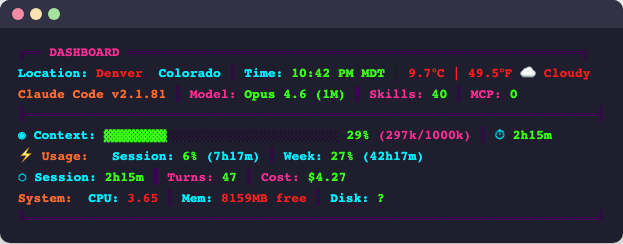

#### Terminal Green
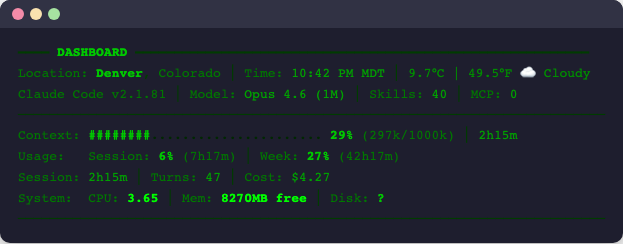

#### Solarized
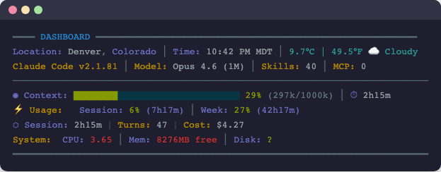

#### Nord
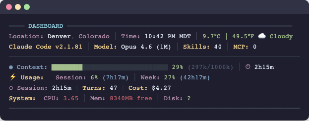

#### Minimal
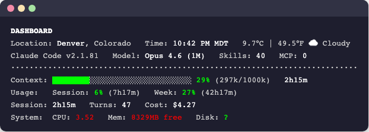

### Superhero Themes

#### Batman
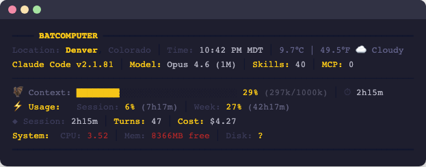

#### Iron Man
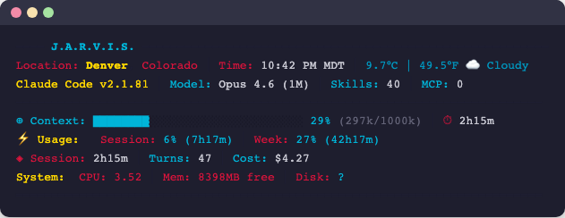

### Anime Themes

#### Dragon Ball Z
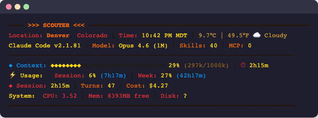

#### Evangelion
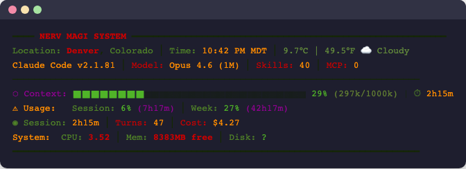

#### Ghost in the Shell
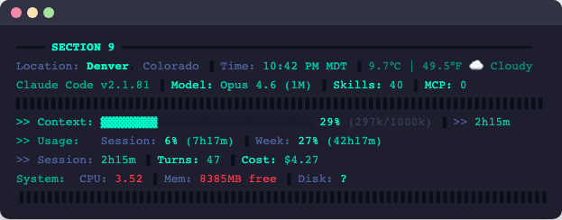

#### Akira
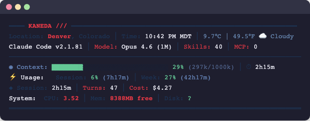

### More Pop Culture Themes

#### Spider-Verse
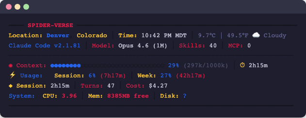

#### Blade Runner
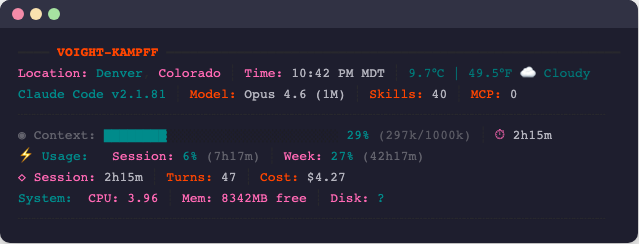

#### One Piece
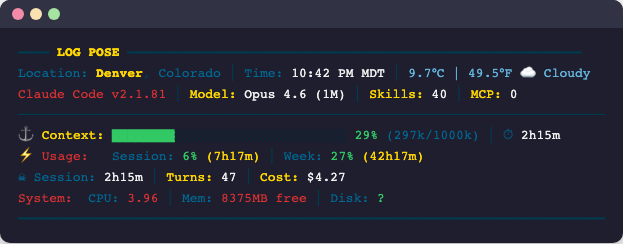

#### Ghibli
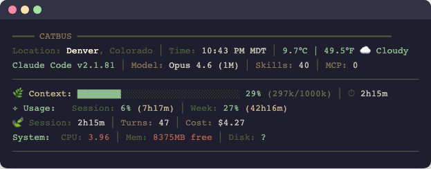

### Nature Themes

#### Rainforest
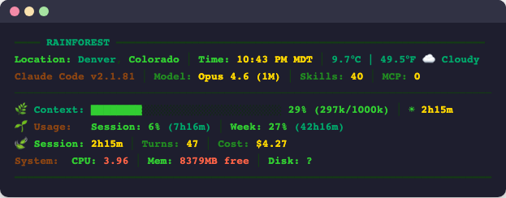

#### Garden
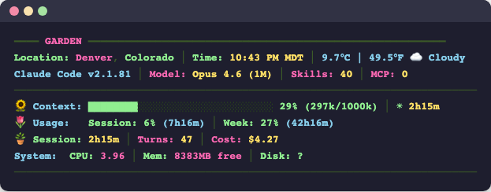

#### Terrarium
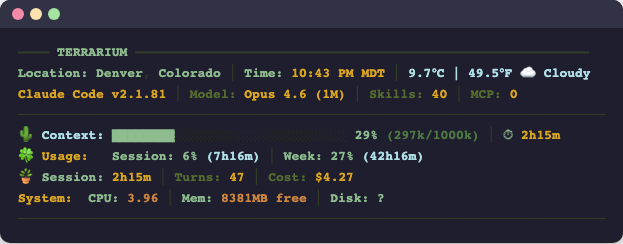

#### Harvest
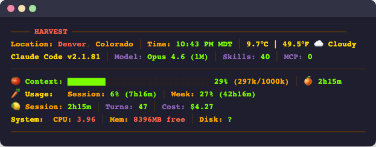

## Theme List

| Theme | Header Name | Style |
|-------|------------|-------|
| `terminal-green` | DASHBOARD | Monochrome green, ASCII bars |
| `solarized` | DASHBOARD | Warm cyan/orange/violet |
| `nord` | DASHBOARD | Arctic frost blues, aurora |
| `cyberpunk` | DASHBOARD | Hot pink, cyan, neon yellow |
| `minimal` | DASHBOARD | No borders, just text |
| `batman` | BATCOMPUTER | Gotham dark + bat yellow |
| `iron-man` | J.A.R.V.I.S. | Arc reactor blue + gold |
| `dbz` | >>> SCOUTER <<< | Power level orange, Ki diamonds |
| `evangelion` | NERV MAGI SYSTEM | NERV red, dark green, amber |
| `ghost-in-shell` | SECTION 9 | Cyan on navy, glitch borders |
| `akira` | KANEDA /// | Capsule red, white, dark blue |
| `spider-verse` | SPIDER-VERSE | Comic red/blue, halftone dots |
| `blade-runner` | VOIGHT-KAMPFF | Rain neon, teal/orange/pink |
| `one-piece` | LOG POSE | Gold, ocean blue, nautical |
| `ghibli` | CATBUS | Forest green, warm brown, cream |
| `rainforest` | RAINFOREST | Emerald, lime, golden sunlight, bark |
| `garden` | GARDEN | Grass green, flower pink, sunny yellow, sky blue |
| `terrarium` | TERRARIUM | Sage, moss, warm amber, glass blue |
| `harvest` | HARVEST | Tomato red, carrot orange, lettuce green, eggplant |

## Configuration

### Environment Variables

| Variable | Default | Description |
|----------|---------|-------------|
| `DASHBOARD_THEME` | `midnight` | Active theme name |
| `DASHBOARD_USAGE_TTL` | `120` | Usage API cache TTL in seconds |
| `DASHBOARD_LOCATION_TTL` | `3600` | Location cache TTL in seconds |
| `DASHBOARD_WEATHER_TTL` | `900` | Weather cache TTL in seconds |
| `DASHBOARD_CONTEXT_BASELINE` | `22600` | Preloaded context tokens baseline |
| `DASHBOARD_CACHE_DIR` | `~/.claude/dashboard-cache` | Cache directory |
| `CLAUDE_CONFIG_DIR` | `~/.claude` | Claude Code config directory |

### Data Sources

- **Location**: [ipinfo.io](https://ipinfo.io) (free, no API key needed)
- **Weather**: [Open-Meteo](https://open-meteo.com) (free, no API key needed)
- **Usage**: Anthropic OAuth API (uses your Claude Code session token from macOS Keychain)
- **Context window**: Provided by Claude Code via stdin JSON
- **Skills/MCP**: Counted from Claude Code config directory

### Responsive Modes

The dashboard adapts to terminal width:
- **Compact** (<40 cols): Minimal single-line data
- **Standard** (40-79 cols): Key metrics, shorter labels
- **Full** (80+ cols): Complete display with all sections

## Requirements

- **bash** 4.0+
- **jq** (JSON parsing)
- **curl** (API calls, cached)
- **Claude Code** (provides session data via stdin)

macOS and Linux supported. Weather and location work on both. Usage API requires macOS Keychain (Claude Code OAuth token).

## Creating Custom Themes

Add a new case to the `load_theme()` function in `dashboard.sh`:

```bash
my-theme)
  T_HEADER="MY DASHBOARD"      # Header text
  T_BORDER='\033[38;2;R;G;Bm'  # Border/divider color
  T_TITLE='\033[38;2;R;G;Bm'   # Header title color
  T_LABEL='\033[38;2;R;G;Bm'   # Label text color
  T_VALUE='\033[38;2;R;G;Bm'   # Value text color
  T_HIGHLIGHT='\033[38;2;R;G;Bm' # Highlighted values
  T_GREEN='\033[38;2;R;G;Bm'   # Low usage color
  T_YELLOW='\033[38;2;R;G;Bm'  # Medium usage color
  T_RED='\033[38;2;R;G;Bm'     # High usage color
  T_DIM='\033[38;2;R;G;Bm'     # Dimmed/background color
  T_SEP="│"                     # Column separator character
  T_BAR_FILL="█"                # Progress bar filled char
  T_BAR_EMPTY="░"               # Progress bar empty char
  T_ICON_CTX="◉"                # Context section icon
  T_ICON_USE="⚡"               # Usage section icon
  T_ICON_SES="⬡"                # Session section icon
  ;;
```

Use `\033[38;2;R;G;Bm` for RGB colors (true color terminals) or `\033[XXm` for basic 256-color.

## Contributing

PRs welcome! Especially:
- New themes (anime, games, movies, music, anything creative)
- Linux compatibility improvements
- Additional data sources
- Responsive mode enhancements

## License

[MIT](LICENSE)
